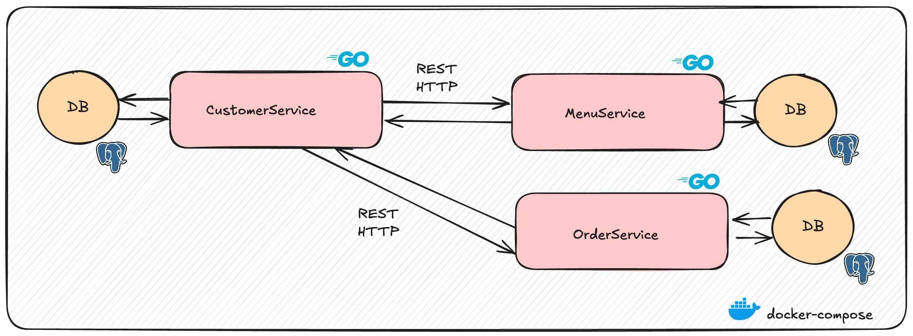

# cj-restaurant

Check `goals.md` for the project goals.

## Architecture

This project is a microservices architecture for a restaurant management system, consisting of three main services:

- **Menu Service**: Manages menu items.
- **Customer Service**: Manages customer and restaurant tables data.
- **Order Service**: Manages orders and billing.



## Requirements

- Docker

## How to run

- Up all services:

```bash
make up
```

- Down all services:

```bash
make down
```

## Notes

- Check `.env-example` file for the expected environment variables.
- Check `Makefile` for available commands.
- Each service has its own Swagger documentation available at the following URLs:
  - Menu Service: [http://localhost:8081/swagger/index.html](http://localhost:8081/swagger/index.html)
  - Customer Service: [http://localhost:8082/swagger/index.html](http://localhost:8082/swagger/index.html)
  - Order Service: [http://localhost:8083/swagger/index.html](http://localhost:8083/swagger/index.html)
